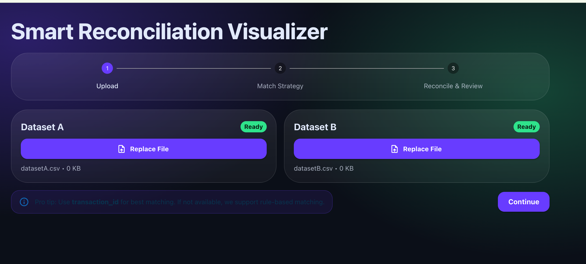
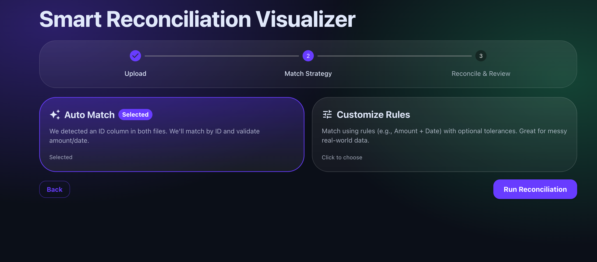
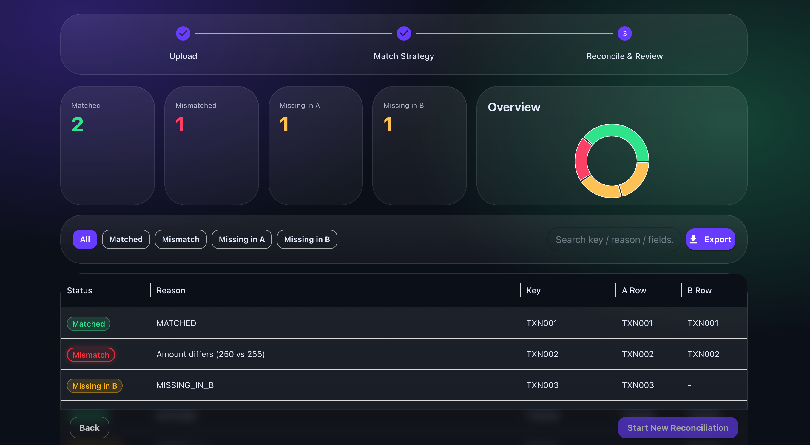
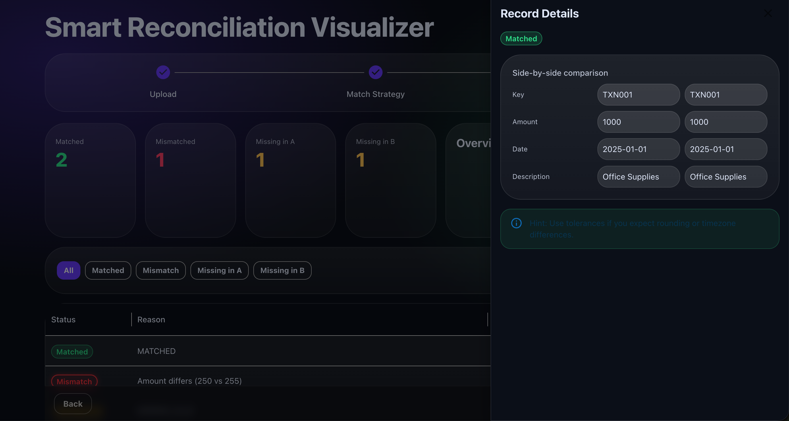

# Smart Reconciliation Visualizer (a UI forward reconciliation tool)

I see myself as a customer first — and with that mindset, I built this project to solve a very real problem:  
**reconciling two datasets and clearly understanding what matched, what mismatched, and what is missing.**

In real-world data (bank statements, ledgers, reports), records are rarely clean. This tool makes reconciliation **visual, intuitive, and explainable**.


[](https://smart-reconcile.netlify.app/)


---

## Features

- Upload two CSV files (Dataset A & Dataset B)
- Auto-detect ID column for matching
- Auto Match or rule-based matching (Amount + Date)
- Categorizes records into:
  - Matched
  - Mismatch
  - Missing in A
  - Missing in B
- Interactive table with filters & search
- Side-by-side record comparison
- Export reconciliation results

---

## How It Works

### 1. Upload
Upload Dataset A and Dataset B (CSV files).



### 2. Match Strategy
Choose:
- **Auto Match** (ID-based)
- **Custom Rules** (Amount / Date based)




### 3. Reconcile & Review
View summary cards and detailed reconciliation table.



### 4. Record Details
Click a row to view side-by-side values from Dataset A and B.




---

## Tech Stack

- React + Vite
- Material UI (DataGrid)
- Node.js + Express

---

## Run Locally

### Backend and Frontend
```bash
cd backend
npm install
npm run dev


cd frontend
npm install
npm run dev

